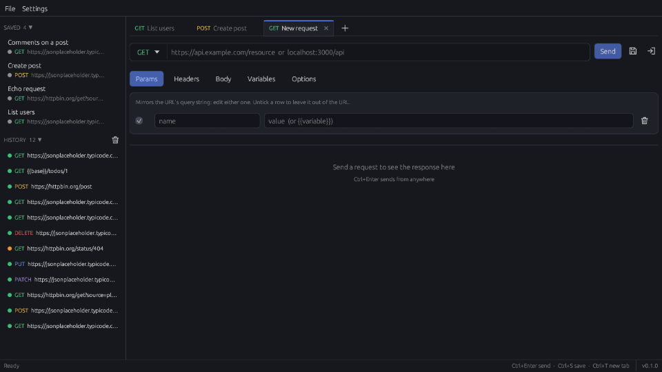
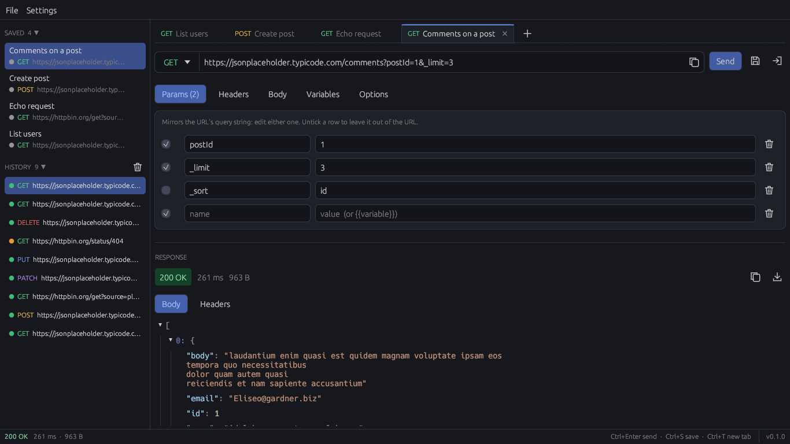
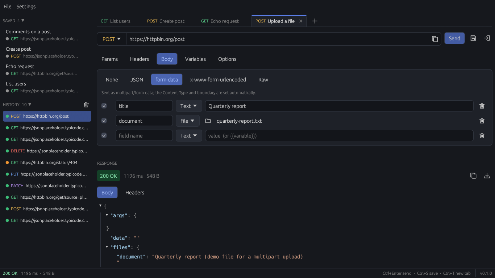
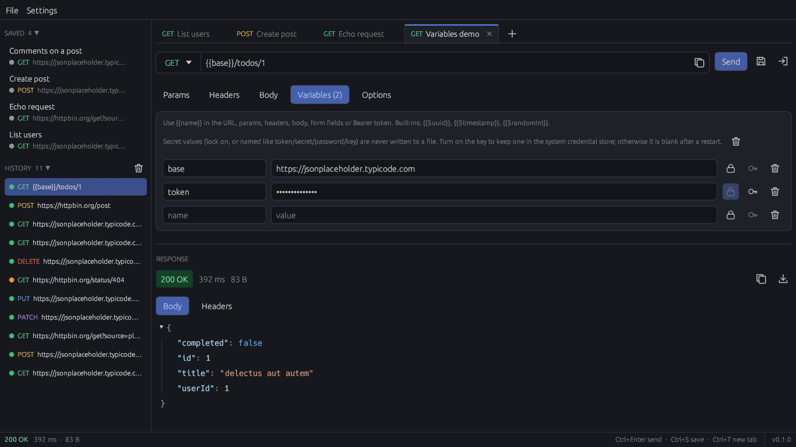
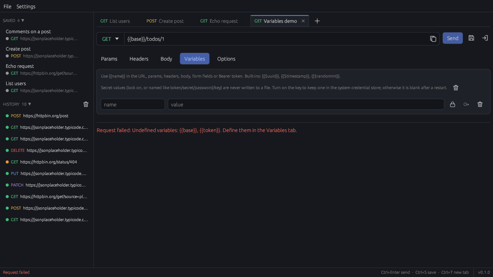
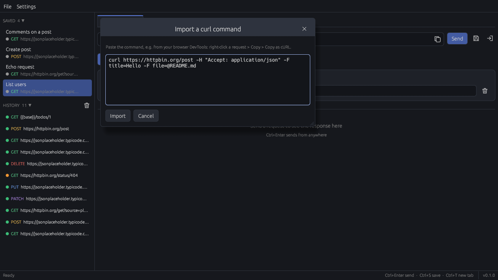
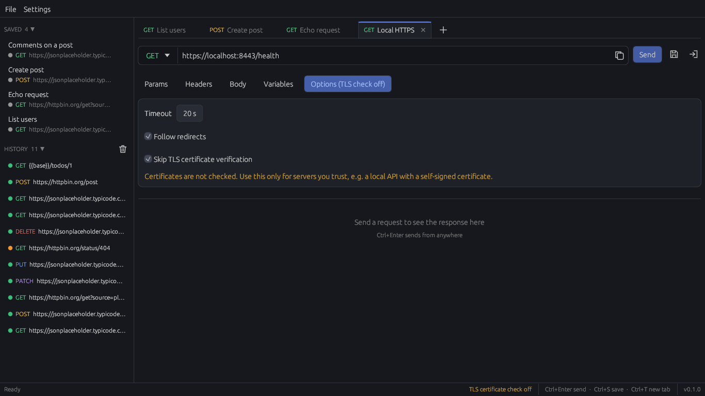
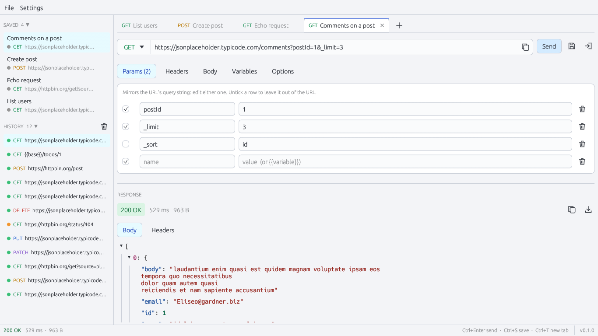

<h1 align="center">Plunger</h1>

<p align="center"><strong>Unclog your API.</strong></p>

<p align="center">
  A tiny native API inspection tool for developers who just want to see what their pipeline is actually doing.<br>
  Make the request. See the JSON. Move on.
</p>

<p align="center">
  <a href="https://github.com/metamug/plunger/releases/latest/download/plunger-windows.zip"><strong>Download for Windows</strong></a> (zip, about 3 MB, no installer)
  &nbsp;·&nbsp; <a href="LICENSE">MIT license</a>
</p>

<p align="center">
  
</p>

## Why?

Sometimes you don't need another platform. You just need to see what the API returned.

AI can write the code. AI can build the pipeline. We still look at the diff before we push. We still look at the logs when something feels wrong. And we still look at the JSON when an API doesn't do what we expected.

Seeing is believing. Plunger is for the moment between "I think it works" and "I can see it works."

We wanted a plunger. So we made one.

## What is Plunger?

A small desktop app that sends an HTTP request and shows you what came back.

- **Request:** GET, POST, PUT, PATCH, DELETE, HEAD, OPTIONS. Params, headers and a Bearer token field.
- **Body:** JSON, form-urlencoded, raw text, or multipart form-data with real file uploads.
- **Response:** status, time and size, the headers, and the body as a collapsible JSON tree. Copy it or save it to a file.
- **Variables:** `{{name}}` anywhere in the request, plus `{{$uuid}}`, `{{$timestamp}}` and `{{$randomInt}}`. A request with an undefined variable is refused, never sent with the placeholder in it.
- **Import:** paste a curl command (including `-F` uploads) or open a HAR file.
- **Keep what matters:** local history, named saved requests (Ctrl+S) and tabs (Ctrl+T).
- **Local HTTPS:** skip certificate checks for a self-signed dev server, with a warning that stays visible while it's on.

It's a native program, not a web page, so it reaches whatever your machine can reach: `localhost`, a dev box on your network, an API that sends no CORS headers.

## Small by design

Built in Rust with [egui](https://github.com/emilk/egui) because we wanted a small, fast, native application. No webview, no bundled browser: one exe of about 6 MB.

No account to create. No cloud to sync to. The only network traffic is the requests you send: no analytics, no telemetry, no update checks. History and saved requests live in one local folder, `%APPDATA%\Plunger\data`. Bearer tokens and secret variables are never written to a file unless you tick "remember", which keeps them in Windows Credential Manager. Credential-looking headers are blanked before history is saved. Details are in the [privacy policy](store/privacy-policy.md).

## Open source

Plunger is MIT licensed. Read it, build it, change it.

A few promises, so you know what you're picking up:

- It will never require an account.
- It will never add telemetry.
- Existing features will never move behind a paywall.

## Screenshots

<table>
  <tr>
    <td width="50%"><br><sub>Request, response, JSON. Saved requests and history on the left.</sub></td>
    <td width="50%"><br><sub>Multipart uploads with real files.</sub></td>
  </tr>
  <tr>
    <td><br><sub>Variables, with secrets masked and kept off disk.</sub></td>
    <td><br><sub>Undefined variables stop the request instead of leaking a placeholder.</sub></td>
  </tr>
  <tr>
    <td><br><sub>Paste a curl command; it becomes a request.</sub></td>
    <td><br><sub>Local HTTPS with self-signed certificates.</sub></td>
  </tr>
  <tr>
    <td colspan="2" align="center"><br><sub>Light theme too.</sub></td>
  </tr>
</table>

## Install

1. [Download `plunger-windows.zip`](https://github.com/metamug/plunger/releases/latest/download/plunger-windows.zip) and unzip it anywhere.
2. Run `plunger.exe`.

Windows 10 (1809) or 11, 64-bit. Plunger isn't code-signed yet, so Windows may say "Windows protected your PC": click **More info**, then **Run anyway**. Or [build it yourself](#build-from-source).

To update, replace the exe. To remove it, delete the exe and `%APPDATA%\Plunger`.

## Usage

1. Paste a URL, or import a curl command.
2. Press **Ctrl+Enter**.
3. Read the response.

That's it.

## Build from source

```bash
rustup toolchain install stable-x86_64-pc-windows-gnu
rustup default stable-x86_64-pc-windows-gnu
# plus mingw-w64 (gcc, windres, dlltool) on PATH, e.g. from WinLibs or MSYS2

cargo build --release     # target/release/plunger.exe
cargo test
```

Set `PLUNGER_DATA_DIR` to run against a throwaway data folder instead of your real history.

## Contributing

Issues and pull requests are welcome. Before adding a feature, ask: does this help someone quickly see what an API is doing? Would someone open Plunger specifically for it? If yes, it probably belongs. Accounts, sync, collaboration and platform features don't.

Run `cargo test` and `cargo clippy --all-targets` before sending a PR. Maintainers: releases are GitHub releases with `plunger-windows.zip` attached; Microsoft Store packaging is in [`packaging/`](packaging/README.md).

---

<p align="center">We didn't want another ecosystem. We wanted a plunger.<br><strong>Unclog your API.</strong></p>
