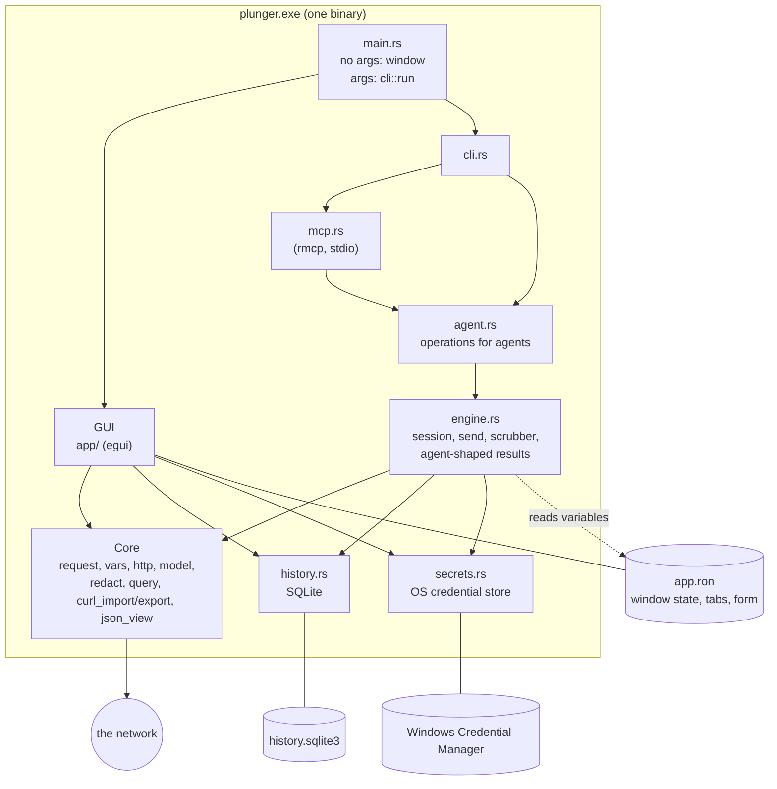

# Plunger: architecture and design

How Plunger is built and why. This describes the code as of version 0.2.0. For using it, see the [README](README.md); for the agent interface in detail, see [docs/agents.md](docs/agents.md).

## 1. What it is, and what it refuses to be

Plunger is a small native Windows app that sends an HTTP request and shows what came back. The same executable is also a command-line client and an MCP server, so an AI agent can send requests through it and a person can watch them arrive.

Design rules that decide most questions:

- **One job: see what an API did.** Features that don't help with that (accounts, sync, collaboration, monitors) don't belong.
- **Local only.** No account, no cloud, no telemetry, no update checks. The only traffic is the requests that are sent.
- **One engine.** The window, the command line and MCP send through the same code, so their safety behaviour can't drift apart.
- **Small.** One exe of about 7 MB, no webview, no async runtime in the GUI path.
- **Secrets never touch disk by accident.** Credentials are blanked before anything is written, and only stored (in the OS credential store) if the user opts in.

## 2. Big picture



Three ways in, one core. A person uses the window; an agent uses `plunger <command>` or `plunger mcp`. The window and an agent can run at the same time: they share the history database and the window picks up the agent's requests live.

## 3. Modes and entry point

`main.rs` decides the mode from its arguments:

| Invocation | Mode |
|---|---|
| `plunger` | Opens the window. |
| `plunger send / import / saved / history / vars / export` | Headless CLI: prints JSON, exits with a meaningful code. |
| `plunger mcp` | MCP server on stdin/stdout until the client disconnects. |

Details that matter:

- The release build is a Windows GUI program (`windows_subsystem = "windows"`), so it starts without a console. For CLI commands it attaches to the parent console so typed-by-hand output appears (`cli::attach_parent_console`). It never does this for `mcp`, which must keep the pipes its client gave it. Piped output, the way agents run it, works without any of this.
- Release builds are `panic = "abort"`, so `main` installs a panic hook that appends to `crash.log` in the data folder.
- `PLUNGER_DATA_DIR` moves everything (history, window state, crash log) to another folder, for demos and tests.

## 4. Modules

| Layer | Module | Responsibility |
|---|---|---|
| Entry | `main.rs` | Mode selection, crash log, window options and startup. |
| GUI | `app/mod.rs` | `ApiTesterApp`: tabs, sidebar lists, import dialogs, shortcuts, per-frame update, saving state. |
| | `app/tab.rs` | `Tab`: one open request, its response, and its in-flight send. |
| | `app/chrome.rs`, `sidebar.rs`, `command_bar.rs`, `import_window.rs`, `response_panel.rs`, `request/*` | Menu bar, status bar and tab strip; Saved and History lists; the URL bar; import dialogs; the response view; the Params, Headers, Body, Variables and Options editors. |
| | `theme.rs`, `icons.rs`, `json_view.rs` | Dark and light palettes and styling; hand-painted vector icons; JSON tree and syntax colouring. |
| Core | `model.rs` | `PersistedState` (a request form), `ResponseData`, `ParsedRequest`, `Variable`. |
| | `request.rs` | Builds the request that will be sent from the form: variable substitution, body assembly, headers. `prepare_to_send` is the one "press Send" step. |
| | `vars.rs` | The `{{variable}}` resolver; built-ins `$uuid`, `$timestamp`, `$randomInt`; refuses undefined names. |
| | `http.rs` | Sends the request (blocking reqwest) and turns the reply into `ResponseData`. |
| | `query.rs` | URL and Params table in two-way sync, and percent-encoding. |
| | `curl_import.rs`, `curl_export.rs` | curl and HAR to a request, and a request back to curl. |
| | `redact.rs` | Which headers and parameters are credentials; blanking them. |
| Storage | `history.rs` | SQLite: history and saved requests. |
| | `secrets.rs` | Remembered secrets in the OS credential store. |
| Agents | `engine.rs` | Session (variables, remembered secrets), send with history, the `Scrubber`, agent-shaped results. |
| | `agent.rs` | The six operations, shared by the CLI and MCP. |
| | `cli.rs`, `mcp.rs` | Argument parsing, output and exit codes; MCP tool definitions. |

Dependencies only point downward: the GUI and the agent layer use the core; the core knows nothing about either.

## 5. The request pipeline

Everything that sends goes through the same steps:

```
PersistedState (the form)
   │  prepare_to_send            fill in a missing scheme (unless the URL uses {{variables}})
   ▼
build_request                    resolve {{variables}} (undefined → error, nothing sent),
   │                             encode values placed in the query string,
   │                             assemble the body, add Content-Type / Bearer
   ▼
OutgoingRequest
   │  http::execute              blocking reqwest: timeout, redirects (max 10), optional TLS skip
   ▼
ResponseData                     status, timing, headers, body (read capped at 10 MB),
                                 parsed JSON when the body is JSON
```

Points worth knowing:

- **The form keeps `{{templates}}`, never resolved values.** Resolution happens only inside `build_request`, so a resolved secret can't be written back into the URL field or into history.
- **Undefined variables are refused, not sent.** This is checked in `Resolver::finish`, and it is the same code for the window, CLI and MCP.
- **Bodies are read raw and capped**, so the reported size is the real payload size even if it isn't valid UTF-8, and a huge response can't freeze the window.
- **Bearer is never part of the form.** It's held separately in memory, and only stored if the user ticks "remember".
- **Cancelling** in the window only stops the UI waiting. `reqwest::blocking` can't be interrupted, so the thread finishes and its result is dropped.

## 6. The window

Built with egui/eframe (immediate mode, glow renderer). State lives in `ApiTesterApp`; each frame `update` polls for finished sends, polls the database, handles shortcuts, and draws.

- **Tabs.** Each `Tab` owns a whole request (form, response, in-flight send). Session settings (variables, timeout, redirects, TLS) are shared: opening or switching a tab carries them over, because they belong to the session, not to a request. An untouched blank tab is reused when something is opened; an already-open saved request is switched to rather than duplicated.
- **Saved vs history.** History is what was sent; Saved is a named subset that is never pruned. Double-click a row to name it (saving it). Both lists come from one table (see section 7).
- **URL and Params stay in sync.** The Params table and the URL query string edit the same thing. `synced_url` records the URL as of the last sync; if the field no longer matches, the table is rebuilt from the URL. Disabled rows are kept in the table but left out of the URL.
- **Request lifecycle** is one enum, `RequestStatus { Idle, InFlight { rx, sent } }`, so "loading", "who to poll" and "what was sent" can't disagree. The `sent` snapshot is what goes into history, even if the form is edited before the response arrives.
- **Theme.** A `Palette` struct with `DARK` and `LIGHT` constants and `palette()` for the current one; nothing hard-codes a colour. The choice is pinned so the OS light/dark setting can't override it.
- **Icons are painted, not glyphs**, so they can't show as missing-character boxes on any system font.
- **Layout guards.** Hover-only controls are drawn in an overlay (`theme::overlay`) that takes no layout space, so rows don't jump. A long request scrolls in its own area capped at 45% of the window, so the response stays visible.
- **Headless UI tests.** `render_ui` runs without a window, so tests draw every state (both themes, dialogs, agent-tagged rows) and catch panics.

## 7. Data and persistence

Three stores, each for a different kind of data:

| Store | Holds | Never holds |
|---|---|---|
| `app.ron` (eframe state file) in the data folder | Window size and position, the open tabs, the current form, the theme. Written on close and about every 30 seconds. | Secret values, Bearer token, credential-looking headers and parameters (blanked first via `redacted()`). |
| `history.sqlite3` (bundled SQLite) | Every sent request and every saved request, with who sent it. | The same: credentials are blanked before insert. |
| Windows Credential Manager (`keyring`) | Secret variables and the Bearer token, only when the user ticks "remember". | Anything else. |

The data folder is `%APPDATA%\Plunger\data`, or `PLUNGER_DATA_DIR` if set.

**History table.** One table, `requests`: method, URL, headers, body fields, status, elapsed time, plus columns added over time by in-place migration (`extra_json` for params and multipart fields, `name`, `in_history`, `source`). A row is *saved* if it has a `name`. `in_history` goes to 0 when the history is cleared, so a saved request outlives Clear. Only unnamed rows are pruned, beyond 1000; saved ones never are. The sidebar shows the newest 50.

**Sharing the database.** The window and an agent can be open at once. The database runs in WAL mode with a 5 second busy timeout, so a second writer waits instead of failing. The window checks `PRAGMA data_version` every 1.5 seconds (one cheap query) and re-reads its lists only when another connection has committed, which is how an agent's requests appear without a click.

## 8. The agent interface

```
plunger send / import / …      plunger mcp
        │                          │
        └───────┐      ┌───────────┘
             cli.rs  mcp.rs
                └──┬──┘
                agent.rs        six operations (send, import, list saved, history, variables, export curl)
                   │
                engine.rs       Session · send · Scrubber · AgentResponse
                   │
      request.rs / http.rs / history.rs / secrets.rs   (the same code the window uses)
```

- **Session.** An agent inherits the user's variables and options by reading the window's `app.ron`, and remembered secrets from the credential store. This is why a variable edited in the window can take up to about 30 seconds to reach an agent.
- **Send.** `engine::send` calls `prepare_to_send` and `http::execute`, then records the request in the shared history tagged with its `Source` (`gui`, `cli` or `mcp`).
- **Results for models.** `AgentResponse` is structured (`ok`, `status`, `elapsed_ms`, `size_bytes`, `headers`, `json` or `body`). Bodies over 50,000 characters are cut and marked with their full length. Errors say what to do next; for an undefined variable, how to supply one.
- **The Scrubber.** Every known secret value is replaced by `[redacted:name]` in the body, the JSON and the headers, including URL-encoded spellings, so a server that echoes a token back can't hand it to the agent. Masking happens before a long body is cut, so a cut can't leave half a secret behind. Credential headers such as `Set-Cookie` are blanked. Secrets shorter than 4 characters aren't masked.
- **MCP.** Six tools (`send_request`, `import_curl`, `list_saved_requests`, `get_history`, `list_variables`, `export_curl`) defined with `rmcp`'s `#[tool]` macros. Read-only ones are annotated so clients can skip prompting. Descriptions say when to use each instead of curl. Blocking work (network, SQLite, credential store) runs in `spawn_blocking`; tokio is used only here, with a single-threaded runtime.
- **CLI.** Everything prints JSON, errors included. Exit codes: 0 ok, 1 bad command line, 2 not sent, 3 no response, 4 `--fail` and status 400 or above. `export` prints plain text.

## 9. Security model

The threat modelled: a local user who wants their credentials off disk, and an agent that might be manipulated (prompt injection) or simply careless.

| Risk | Mitigation |
|---|---|
| A credential written to disk by accident | Blanked before `app.ron` and history are written (`redacted()`); Bearer isn't part of the form; secrets only stored in the OS credential store, and only on opt-in. |
| An unresolved placeholder sent to a server | Undefined `{{variable}}` refuses the send, in every mode. |
| A secret reaching the agent | No tool returns a secret value; the Scrubber masks echoes; `list_variables` returns names only for secrets. |
| An agent sending the saved Bearer token to a host of its choosing | Off by default; a request must set `use_saved_bearer`. |
| An agent uploading files from disk | `send_request` over MCP can't send files. |
| A variable value breaking a query string | Values substituted into the query are percent-encoded. |
| Huge responses | Read capped at 10 MB; agent bodies capped at 50,000 characters. |

What is deliberately *not* prevented: an agent can put `{{token}}` into a request to any host, so a remembered secret can be sent wherever the agent chooses. Plunger can't know which hosts you trust; the docs say so, and access should only be given to agents you'd trust with that.

## 10. Build, test, release

- **Toolchain.** Rust stable, `x86_64-pc-windows-gnu` with mingw-w64 (for the bundled SQLite and `windres`). The release profile is size-optimised with LTO, one codegen unit, stripped, `panic = "abort"`.
- **Tests.** 148 unit and UI tests. HTTP behaviour is tested against a tiny in-process server (`test_server.rs`) that can echo requests back, which is how secret masking is proved end to end. MCP was also checked against the real release exe over stdio with a scripted client.
- **CI** (GitHub Actions): tests, `clippy -D warnings` and a release build on Windows; a compile check on Linux and macOS that doesn't fail the build, since Windows is the only supported platform.
- **Release.** Pushing a `v*` tag builds and publishes `plunger-windows.zip`.

## 11. Decisions and trade-offs

| Decision | Why | Cost |
|---|---|---|
| egui, not a webview | One small native exe, fast start, no CORS. | Own widgets and text handling; less polish than a browser engine. |
| Blocking reqwest on a thread, no async in the GUI | Simple; a request is a single call. | Can't cancel in flight, only stop waiting. |
| One exe with modes, not separate binaries | One thing to download; one engine. | Console quirk on Windows (see section 3). |
| SQLite (bundled) for history | Queryable, atomic, safe with two processes in WAL mode. | Needs a C toolchain to build. |
| Agents read the window's state file for variables | No second store to keep in sync. | Up to about 30 seconds of lag. |
| Saved requests live in the history table | One list, one schema, and "name it to keep it" is natural. | A column-per-feature table that grows by migration. |
| `rmcp`, the official MCP SDK | Correct protocol handling, typed tools and schemas. | A tokio dependency (kept to the MCP path). |
| No automatic retry | A human is watching, and clicking Send again is a retry. | None for the intended use. |

## 12. Known limits and open items

- Windows only. The code has macOS keychain support and compiles on Linux, but only Windows is built and tested.
- No search in the HAR request list, and none in History.
- No code signing yet, so Windows shows a SmartScreen warning.
- Variables edited in the window reach agents after the next state save (up to about 30 seconds).
- Agents can't upload files over MCP; the command line can.
- The remaining agent risk is section 9's last paragraph: `{{secret}}` can be sent anywhere the agent points it.
