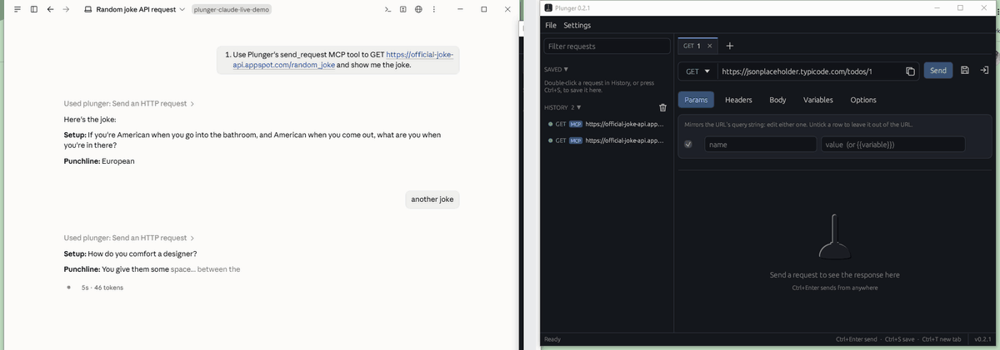
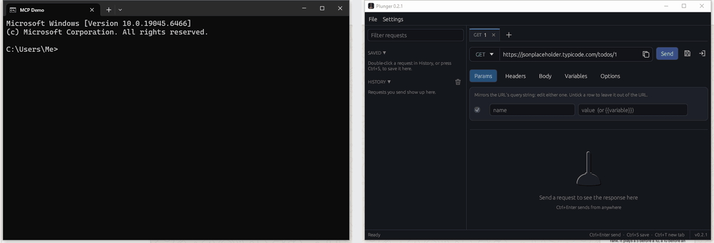

# Plunger for AI agents

Plunger is one executable with three ways in:

| You run | You get |
|---|---|
| `plunger.exe` | The window. |
| `plunger.exe <command>` | The command line: JSON on stdout, meaningful exit codes. |
| `plunger.exe mcp` | An MCP server on stdin/stdout, for Claude Code, Cursor and other MCP clients. |

All three send requests through the same engine as the window's Ctrl+Enter, and all three write to the same local history. You can open Plunger afterwards and see exactly what an agent sent.

## Why not just let the agent run curl?

- **Undefined variables are refused.** A request with an undefined `{{variable}}` is never sent. curl would send the placeholder text.
- **Secrets stay by name.** Secrets you've chosen to remember (the key icon on a secret variable or the Bearer field) live in Windows Credential Manager, and only those are available to an agent. The agent writes `{{token}}`; Plunger fills it in. No tool output contains a secret value, and if a server echoes one back, it is replaced with `[redacted:token]`.
- **Structured results.** Status, time, size, headers and the parsed JSON body come back as separate fields, and long bodies are cut to a size a model can read.
- **An audit trail.** Every agent request lands in Plunger's history, tagged `MCP` or `CLI`, and the window picks it up live.

## Set it up in Claude Code

Add Plunger to your project's `.mcp.json` (use the path where you unzipped it):

```json
{
  "mcpServers": {
    "plunger": {
      "command": "C:\\Tools\\plunger\\plunger.exe",
      "args": ["mcp"]
    }
  }
}
```

Or from a terminal:

```bash
claude mcp add plunger -- "C:\Tools\plunger\plunger.exe" mcp
```

Any MCP client that can launch a stdio server works the same way: the command is `plunger.exe` and the only argument is `mcp`.

Once it's added, an agent's calls show up in Plunger's own history live, tagged `MCP`. This is real Claude Code, unedited, asked to fetch a joke through Plunger and then asked twice more:

<p align="center">
  
</p>

### Seeing the raw protocol

Claude Code's chat hides the actual bytes on the wire behind "Used plunger: Send an HTTP request." If you're building your own MCP client and want to see the literal JSON-RPC frames, [`scripts/mcp-demo-client.py`](../scripts/mcp-demo-client.py) is a minimal reference client with no SDK — it does the same initialize handshake and one `tools/call`, and prints every frame:

```bash
python scripts/mcp-demo-client.py path\to\plunger.exe
```

<p align="center">
  
</p>

## MCP tools

| Tool | What it does |
|---|---|
| `send_request` | Sends a request and returns `status`, `ok`, `elapsed_ms`, `size_bytes`, `headers`, and the body (`json` when it parses, otherwise `body`). Send a saved request by name with `saved_request`, or describe one with `method`, `url`, `headers`, and one of `json`, `body` or `form`. `variables` adds or overrides `{{variables}}` for this request only. |
| `import_curl` | Parses a curl command into a request without sending it. With `save_as`, adds it to the Saved list. |
| `list_saved_requests` | The user's saved requests: name, method, URL, headers, and the `{{variables}}` each one needs. |
| `get_history` | Recent requests, newest first, with who sent each (`gui`, `cli` or `mcp`). Optional `search` narrows it to a URL, method, name or status (for example `orders` or `500`). Credentials are blanked. |
| `list_variables` | Variable names; values only for non-secret variables. Also says whether a saved Bearer token is available. |
| `export_curl` | A saved request or history entry as a curl command, with `{{variables}}` left as placeholders. |

The read-only tools are marked as such, so a client can run them without asking.

## Command line

```bash
plunger send "Get user" --var id=42              # a saved request, by name
plunger send --url "{{base}}/users" -H "Accept: application/json"
plunger send --url https://api.example.com/items -X POST --json '{"name": "widget"}' --fail
plunger import "curl https://api.example.com/items -d 'a=1'" --send
plunger import "curl https://api.example.com/items" --save "List items"
plunger saved
plunger history --limit 5
plunger history --search orders      # URL, method, name or status contains the text
plunger vars
plunger export "Get user"
plunger --help
```

Everything prints JSON, errors included: `{"error": "...", "kind": "not_sent"}`. `export` prints the curl command as plain text.

| Exit code | Meaning |
|---|---|
| 0 | Done (any HTTP status, unless `--fail`) |
| 1 | Bad command line |
| 2 | Not sent, e.g. an undefined `{{variable}}`, or another error |
| 3 | Sent, but no response (refused, DNS, timeout) |
| 4 | `--fail` was given and the status was 400 or higher |

### `plunger curl`: curl's options, Plunger's safety

An agent that already writes curl commands can swap `curl` for `plunger curl` and change nothing else. The arguments are curl's, the output is curl's (the response body, byte for byte, on stdout), and the request still goes through Plunger: an undefined `{{variable}}` is refused, secrets are filled in and masked, and the request lands in the history the window shows.

```bash
plunger curl -sS https://api.example.com/items
plunger curl -s -X POST https://api.example.com/orders   -H "Authorization: Bearer {{token}}" -H "Content-Type: application/json" -d @order.json --var token=...
plunger curl -sL https://example.com/old -o /dev/null -w "%{http_code} %{url_effective}
"
plunger curl -sf https://api.example.com/health || echo "unhealthy"
plunger curl -s -F file=@report.csv https://api.example.com/upload
```

| Supported | Notes |
|---|---|
| `-X -H -d -u -F -G -A -b -e --json --data-urlencode --url` | `-d @file` and `-d @-` (standard input) read the body like curl does |
| `-L -k -s -S -i -I -f --fail-with-body -m/--max-time -o -w` | Like curl, redirects are followed only with `-L`. `-w` knows `%{http_code} %{size_download} %{time_total} %{time_starttransfer} %{content_type} %{num_redirects} %{url_effective} %{redirect_url}` |
| clustered flags | `-sSL`, `-XPOST`, `-ofile` |
| Plunger extras | `--var name=value`, `--use-saved-bearer`, `--plunger-json` (print Plunger's structured result instead) |

These are refused with a message rather than silently ignored: `-x/--proxy`, `--cert`, `--key`, `--cacert`, `-T`, `-K`, `--resolve`, `--interface`, `-c/--cookie-jar`, `--retry`.

Exit codes follow curl: 0 ok, 22 with `-f` and a status of 400 or higher, 6 DNS, 7 connection refused, 28 timeout, 60 TLS, and 2 when Plunger refused to send (for example an undefined variable), which is always reported on stderr even with `-s`.

To hand a request from the window to an agent or a script, **File > Copy as** writes it as curl (bash), curl (Windows cmd) or PowerShell, and `plunger export` prints the curl form.

A URL can also be given straight to `send`: `plunger send https://api.example.com/items`.

`plunger.exe` is a Windows GUI program. Agents run it with piped output and that works normally. Typed by hand in a terminal, the output still appears, but the prompt may come back before it does.

## What an agent can and can't do

- **OS environment variables can enter requests.** `{{$env:NAME}}` reads NAME from Plunger's process environment at send time. Treat those values like other secrets: they can be sent to any request destination even though they are not stored in Plunger's state or history.
- **Variables come from the window.** The agent sees the variables configured in Plunger. The window saves its state when it closes and about every 30 seconds, so a variable edited a moment ago may take that long to reach an agent.
- **The saved Bearer token is off by default.** It's only attached when a request sets `use_saved_bearer` (`--use-saved-bearer` on the command line). An agent chooses its URLs, and the token should only go where you intend.
- **`{{secret}}` can still go anywhere.** The agent never sees a secret's value, but it can put `{{token}}` into a request to any host. Only give an agent Plunger access in projects where you trust where its requests go.
- **No file uploads over MCP.** `send_request` over MCP can't upload files, so a prompt-injected agent can't send files from your disk. The command line and the window can.

## Trying it without touching your data

Set `PLUNGER_DATA_DIR` to an empty folder and Plunger (window, CLI and MCP alike) uses that folder for its history and settings instead of `%APPDATA%\Plunger`.
